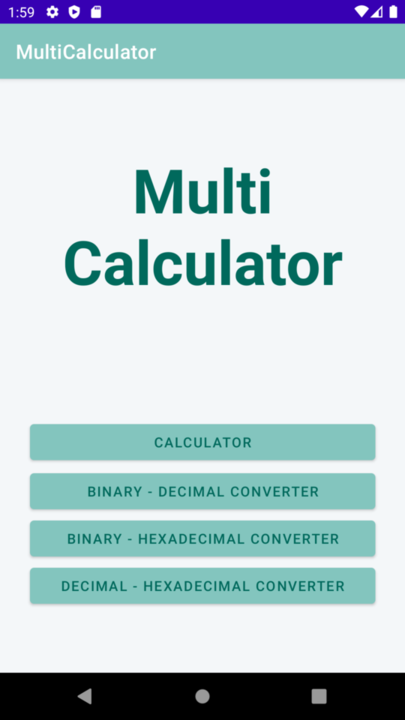
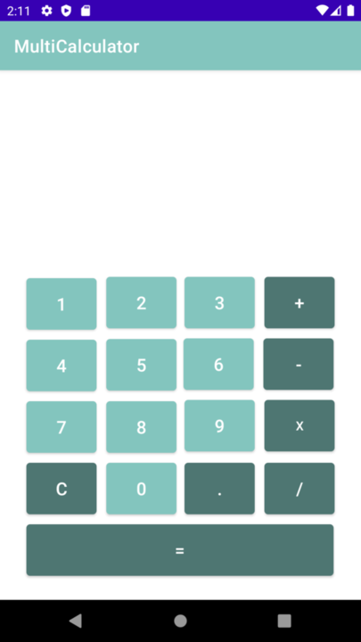
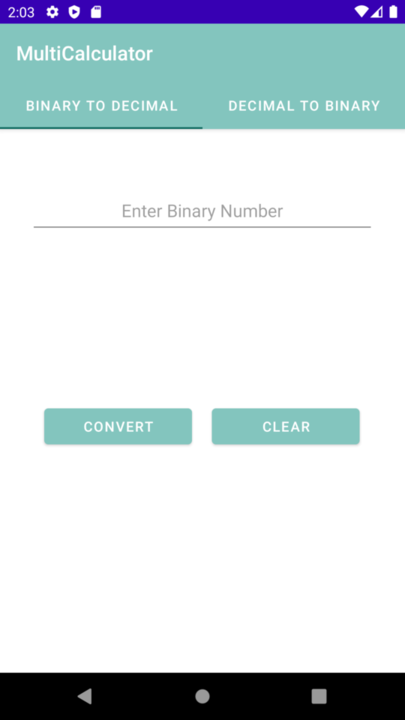
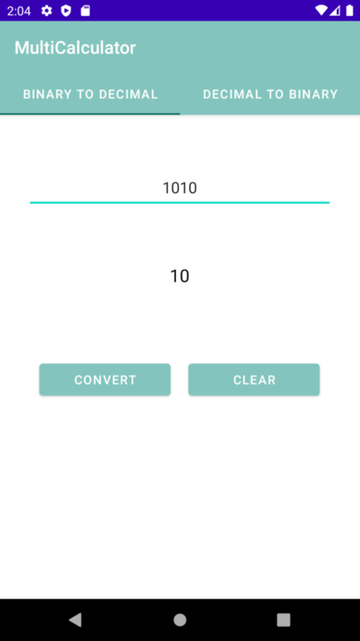
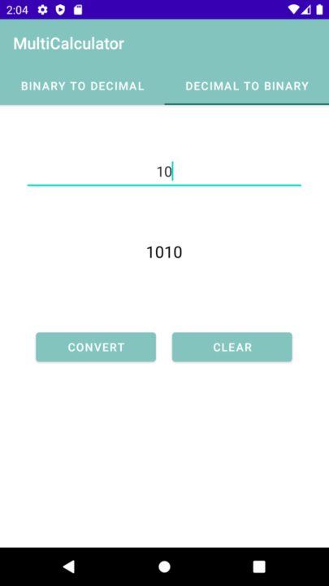
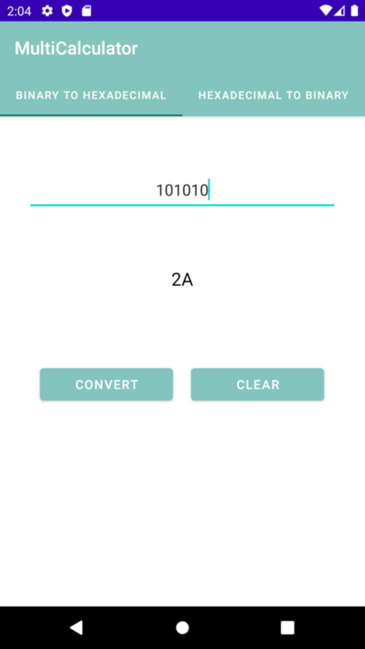
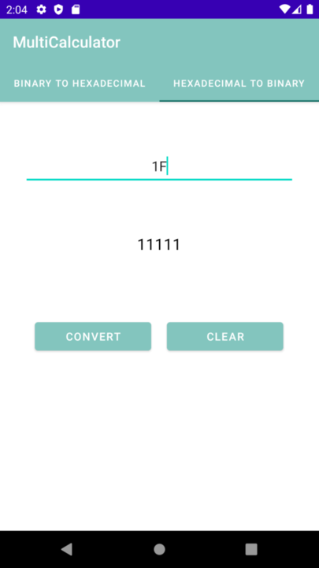
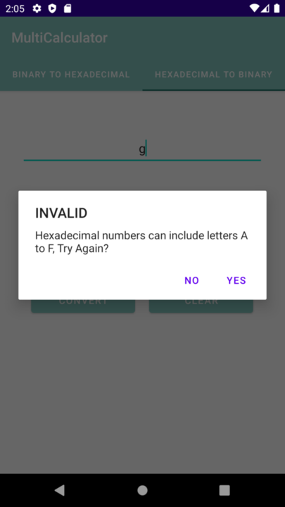
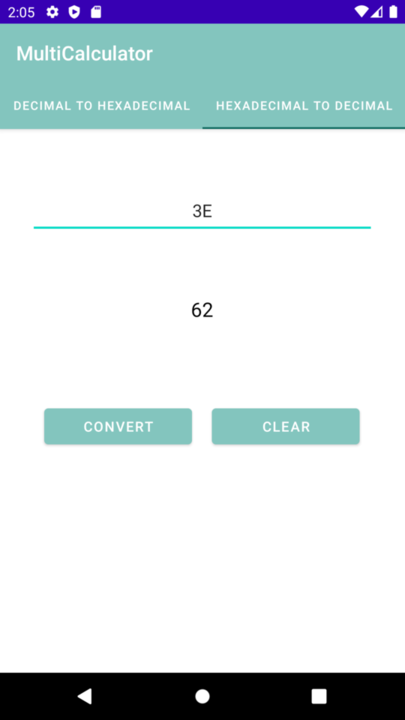

# multiCalculator App
## Home Page
  
App has 4 main functions:
  -Calculator
  -Converting Binary to Decimal & Decimal to Binary
  -Converting Binary to Hexadecimal & Hexadecimal to Binary
  -Converting Decimal to Hexadecimal & Hexadecimal to Decimal

## Calculator 

Calculator can do simplest mathematical operations like addition, subtraction, multiplication, division.

##Binary - Decimal Converter

   

Can convert binary to decimal and decimal to binary

##Binary - Hexadecimal Converter 

  

Can convert binary to hexadecimal and hexadecimal to binary

##Decimal - Hexadecimal Converter 

 

Can convert decimal to hexadecimal and hexadecimal to decimal
